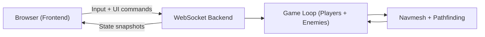

# Navmash

A small full-stack multiplayer prototype with server-authoritative simulation, navmesh pathfinding, and enemy chase AI.

This repository is intentionally split into two projects:

- `backend/` - simulation, authoritative state, AI, WebSocket server
- `frontend/` - browser rendering, controls, UI for AI mode and enemy spawning

## Table Of Contents

1. Project goals
2. Quick start
3. Repository structure
4. High-level architecture
5. Business logic
6. Data model
7. Networking protocol
8. AI behavior details
9. Navmesh/pathfinding details
10. Frontend behavior
11. Developer workflows
12. Configuration
13. Troubleshooting
14. Extending the system

## 1. Project Goals

The project demonstrates:

- Server-authoritative gameplay logic
- Scene-driven navmesh generation at server startup
- Pathfinding-based enemy AI (default and predictive modes)
- A browser client that visualizes entities and paths
- Runtime UI controls for AI mode and enemy spawning

## 2. Quick Start

### Prerequisites

- Node.js 18+
- npm

### One-command install + run (recommended)

From repo root:

```bash
npm install
npm start
```

This starts:

- Backend at `http://localhost:3000`
- Frontend at `http://localhost:5173`

Open `http://localhost:5173` in your browser.

### Run projects separately

Backend:

```bash
cd backend
npm install
npm start
```

Frontend:

```bash
cd frontend
npm start
```

## 3. Repository Structure

```text
navmash/
  backend/
    src/
      index.js          # backend HTTP + WebSocket bootstrap
      gameServer.js     # authoritative game loop and AI logic
      navmesh.js        # navmesh baking + pathfinding
      scene.js          # floor/obstacle primitive definitions
    package.json
    README.md
  frontend/
    src/
      app/              # application composition/orchestration
      core/             # runtime config + protocol constants
      input/            # keyboard intent controller
      network/          # WebSocket transport client
      render/           # Three.js world renderer
      store/            # frontend state store
      ui/               # React components + CSS
      main.jsx          # React entrypoint
    index.html          # Vite entry HTML
    vite.config.js      # Vite config
    package.json
    README.md
  package.json          # root scripts to run both projects
  README.md
```

## 4. High-Level Architecture

The backend is the single source of truth for gameplay state. The frontend is a visualization/input client.



Key rule: clients never decide movement outcomes. They only send intent (`input`, mode switch, spawn command).

## 5. Business Logic

### Core loop ownership

All gameplay logic is in backend `GameServer`:

- Integrates player movement with collision checks
- Recomputes enemy paths on interval
- Integrates enemy movement along computed paths
- Broadcasts authoritative snapshots to all clients

### Business rules implemented

1. Player movement
- Client sends normalized input vector.
- Server applies speed and collision checks against navmesh walkability.
- Actual position is authoritative on server.

2. Enemy targeting
- Enemy always picks the best player target according to selected AI mode.
- Target is recalculated frequently (`AI_REPATH_INTERVAL`).

3. AI modes
- `default`: chase nearest player current position.
- `advanced`: predictive pursuit using player velocity + interception estimate.

4. Enemy spawning
- UI button sends `spawnEnemy` command.
- Server creates a new enemy in walkable spawn locations.
- New enemy joins simulation and appears in next snapshots.

5. Scene configurability
- Obstacles/floor are code-defined in `backend/src/scene.js`.
- Server rebuilds navmesh on startup from those primitives.

## 6. Data Model

### Backend entities

Player:

```js
{
  id, x, z,
  vx, vz,
  radius,
  speed,
  input: { x, z }
}
```

Enemy:

```js
{
  id, x, z,
  radius,
  speed,
  path: [{ x, z }, ...],
  targetPlayerId
}
```

Navmesh (grid-backed):

```js
{
  cellSize,
  floorBounds,
  width,
  height,
  blocked: Set,
  walkableCells: [{ x, z, wx, wz }, ...]
}
```

## 7. Networking Protocol

Transport: WebSocket (`ws://<backend-host>:3000` by default)

### Client -> server messages

- `input`

```json
{ "type": "input", "input": { "x": 0.0, "z": -1.0 } }
```

- `setAiMode`

```json
{ "type": "setAiMode", "mode": "default" }
```

or

```json
{ "type": "setAiMode", "mode": "advanced" }
```

- `spawnEnemy`

```json
{ "type": "spawnEnemy" }
```

### Server -> client messages

- `init` (sent on connect)

Contains:
- `yourPlayerId`
- `aiMode`
- `scene`
- `navmesh`

- `state` (sent continuously)

Contains:
- `players[]`
- `enemies[]`
- `aiMode`

## 8. AI Behavior Details

### Default mode

- For each enemy, find closest player by squared distance.
- Pathfind to that player’s current position.

### Advanced mode (predictive pursuit)

- For each enemy/player pair, estimate intercept time using relative motion.
- Predict future player position at that intercept time.
- Choose target with minimal positive intercept time.
- Pathfind enemy to predicted target point.

Why this exists:
- Reduces tail-chasing behavior when player strafes.
- Produces more aggressive/anticipatory pursuit.

## 9. Navmesh And Pathfinding Details

### Navmesh representation

This is a grid-based navmesh derived from primitive scene geometry:

- Floor defines global movement bounds.
- Obstacles mark blocked cells.
- Agent radius inflates obstacle AABBs for clearance.

### Pathfinding

- Diagonal corner-cut prevention
- Octile distance heuristic
- Path smoothing via line-of-sight pruning for less stair-stepped motion

## 10. Frontend Behavior

Frontend stack:

- React + Vite for app shell and UI state
- Three.js for 3D world rendering

Behavior:

- Renders scene, navmesh overlay, players, enemies, and enemy paths
- Captures keyboard input (`W/A/S/D`) and sends vectors
- Exposes HUD controls:
  - AI mode dropdown
  - Spawn enemy button
- Follows local player with camera

Important: frontend can request actions, but backend decides final state.

## 11. Developer Workflows

### Run both projects

```bash
npm start
```

### Run one side only

Backend only:

```bash
cd backend && npm start
```

Frontend only:

```bash
cd frontend && npm start
```

## 12. Configuration

### Frontend backend target

By default frontend uses:

- host: current browser hostname
- port: `3000`

Override with query params:

- `backendHost`
- `backendPort`

Example:

`http://localhost:5173/?backendHost=127.0.0.1&backendPort=3000`

### Backend runtime

- `PORT` env var supported (defaults to `3000`)

## Additional Project Docs

- Backend-specific notes: `backend/README.md`
- Frontend-specific notes: `frontend/README.md`
